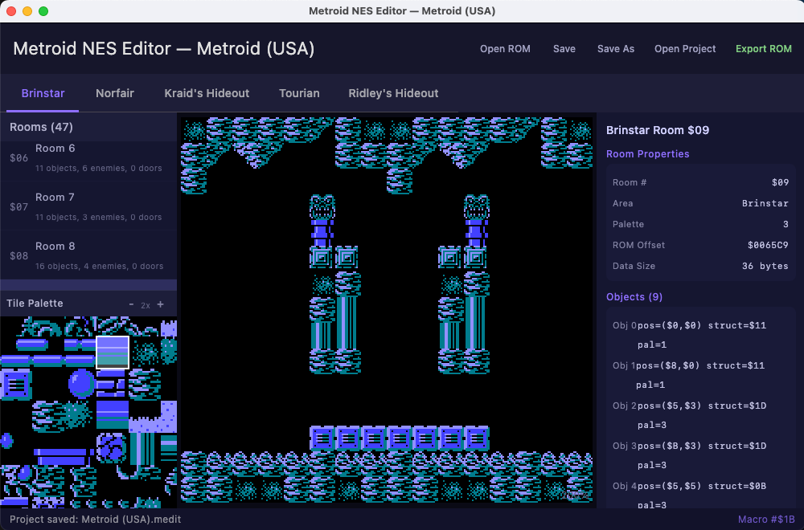
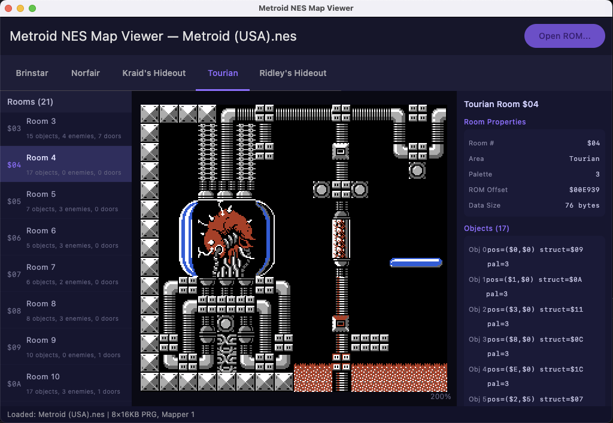
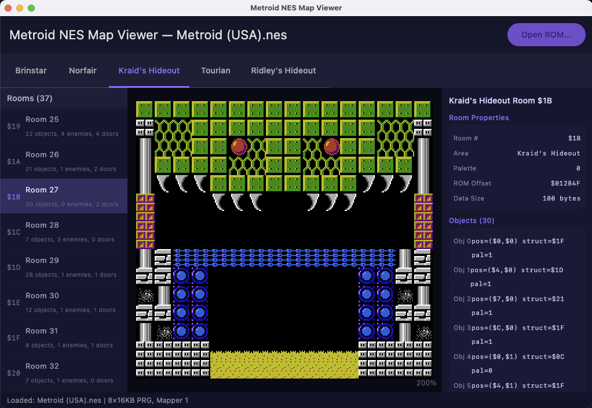

# Metroid NES Editor

  
  
  

## Reference

All durable project docs and context live in [reference/README.md](reference/README.md).

## Thanks To

- The Metroid Community
- github.com/ZaneDubya/MetroidMMC3
